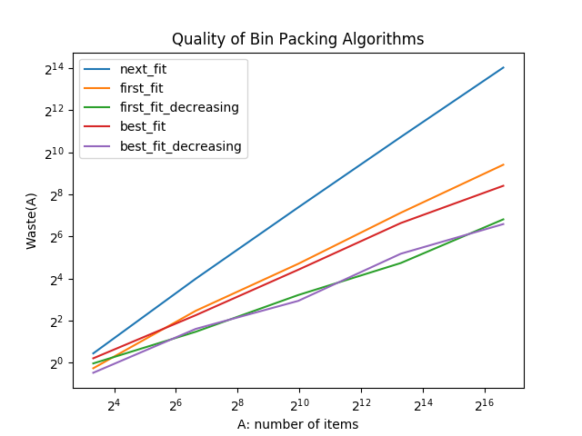
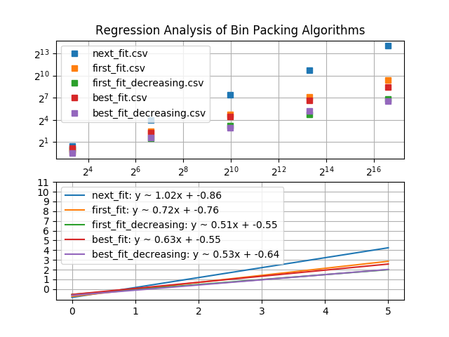

# Project 2 - Testing Solution Quality

## Overview

Project 2 involves testing various bin packing algorithms experimentally to determine the quality of the solutions they produce. Specific bin-packing algorithms to be implemeted and tested are the following five algorithms:

1. Next Fit (NF)

2. First Fit (FF)

3. First Fit Decreasing (FFD)

4. Best Fit (BF)

5. Best Fit Decreasing (BFD)

***NOTE***: Algorithms above except Next Fit algorithm have two implementations. The naive version has time complexity O(N^2). The faster implementation version uses balanced binary search tree (E.g. AVL Tree) ans has time complexity O(N logN).

## Bin Packing Algorithms

This section first introduces bin packing problems ans then explains the implementation and time/space complexity of five different bin packing algorithms. Pseudocode code of algorithms will be shown.

### Bin Packing Problem Definition

Given n items with sizes s1, s2, ..., sn such that 0 < si < 1 for 1 ≤ i ≤ n, pack them into the fewest number of bins of capacity 1. It is safe to assume that all items have weight smaller than bin capactiy and larger than 0.

Applications include:

* Filling recycle bins

* Loading trucks

* Mix tapes

### Next Fit (NF)

Loop through the list of items in order. Check to see if the current item can fit into the current bin. If so, assign it to the current bin and update the remaining free capacity of the current bin. Otherwise, record the final free capacity of the current bin, start a new bin, assign the current item to the new bin, and update the free capacity of the new bin.

Pseudocode code:

```python
def next_fit(items, assignment, free_space):
    for item in items:
        if item <= free space of current bin:
            assign the item to the current bin
            update the free space of the current bin
        else:
            create a new bin
            assign the item to the new bin
            update the free space of the current bin
```

This algorithm processes each item in the list only once so it has time complexity O(N). As of space complexity, it does not use extra space to store items, so it has O(1) space complexity.

### First Fit (FF)

First fit algorithm has two implementations. The two implementations are different in how to find the first bin that can fit the current item.  The slower version implementation scans the list of bins in order to find the first bin that is large enough to hold the current item. The faster version implementation stores bins in balanced binary search tree ordered by bin index and uses the tree to search for the first bin that is large enough to hold the current item.

Loop through each item in the list in order. Place the new item in the first bin that is large enough to hold it. A new bin is created only when the current item does not fit in any of the bins.

Pseudocode:

```python
def first_fit(items, assignment, free_space):

    for item in items:

        for bin in bins:
            if item <= free space of current bin:
                assign the item to the current bin
                update the free space of the current bin
        if no bin can fit the current item:
            create a new bin
            assign the item to the new bin
            update the free space of the new bin
```

The inner loop of the above implementation, in the worst case, processes O(N^2) bins since for each item, it scans every previous bins. Overall, it has time complexity O(N^2) and space complexity O(1) since no extra space is used.

### First Fit Decreasing (FFD)

A problem with the First Fit algorithms is that packing large items is difficult, especially if they occur late in the sequence. The solution is to first sort the items by size, from largest to smallest, then run the First Fit algorithm.

Pseudocode:

```python
def first_fit_decreasing (items, assignment, free_space):
    sort(items)  # order items by size, from largest to smallest
    first_fit(items, assignment, free_space)
```

This algorithm also has slow and fast implementation, since it is based on the First Fit algorithm. Its time complexity is depended on how First Fit algorithm is implemented. Sorting will not affect the overall time complexity because efficient sorting algorithms has time complexity O(N logN) which is less than O(N^2)

### Best Fit

Best fit algorithm has two implementations. The two implementations are different in how to find the best bin that can fit tightest to the current item. The slower version implementation scans the list of bins in order to find a bin where the item fits the tightest. The faster version implementation stores bins in balanced binary search tree ordered by remaining capacity and uses the tree to search for a bin where the item fits the tightest.

Loop through each item in the list in order. Place the new item in a bin where it fits tightest. It it does not fit in any bin, then start a new bin.

Pseudocode:

```python
def best_fit(items, assignment, free_space):
    for item in items:
        for bin in bins:
            find the bin where the current item fits the tightest:
        if find a bin where the current item fits the tightest:
            assign the item to the bin
            update the free capacity of the bin
        else if no bin can fit the current item:
            create a new bin
            assign the current item to the new bin
            update the free space of the new bin
```

The inner loop of the above implementation, in the worst case, processes O(N^2) bins since for each item, it scans every previous bins. Overall, it has time complexity O(N^2) and space complexity O(1) since no extra space is used.

### Best Fit Decreasing (BFD)

A problem with the Best Fit algorithms is that packing large items is difficult, especially if they occur late in the sequence. The solution is to first sort the items by size, from largest to smallest, then run the First Fit algorithm.

Pseudocode:

```python
def best_fit_decreasing (items, assignment, free_space):
    sort(items) # order items by size, from largest to smallest
    best_fit(items, assignment, free_space)
```

This algorithm also has slow and fast implementation, since it is based on the Best Fit algorithm. Its time complexity is depended on how First Fit algorithm is implemented. Sorting will not affect the overall time complexity because efficient sorting algorithms has time complexity O(N logN) which is less than O(N^2)

## Experimental Testing

This sections explains how testing is designed, displays the testing results, and performs analysis of solution quality.

### Test Goal

The goal of these experiments is to determine an estimate for the waste, W(A), for each of the above bin-packing algorithms, A, as a function of n (number of items), as n grows, where W(A) is defined as follows:

The waste, W(A), of a bin-packing algorithm, A, for any given list of items, is the number of bins used by the algorithm A minus the total size (i.e., the sum) of all the items in the list.

### Test Method

Each bin packing algorithm is tested on lists of items of length n, as n grows from 10 to 100000 (10, 100, 1000, 10000, 100000), where the n items in the lists are floating point numbers between 0 and 1 generated uniformly at random. Each algorithm is defined to operate with bins of size 1.

For each length of list of items, generate 5 different random uniformly distributed sequences. For each algorithm, calculate the average waste of algorithm running on the 5 seqeunces.

### Test Result & Analysis

Result of experiments will be ploted on a **log-log** scale. The y-axis represents **log(waste of bin-packing algorithm)** and the x-axis represents **log(number of items)**. In this case, comparing the slope of the line can find which bin packing algorithm has the smallest waste as n grows to a large number.

**Regression analysis** will also be performed on the results of experiments on a **log-log** scale to see if there is a line that fits the data. If so, we can determine the slope of that line, so as to provide experimental evidence for estimating W(A) as a function of n. The function W(A) will also be given.

1. The graph below shows the waste of different bin packing algorithms as n (number of items) grows on a **log-log** scale.

    

2. Perform corresponding regression analysis on the waste of different bin packing algorithms. The following graph shows the regression analysis.

    

Derived from the regression analysis above, we can determine the slope of each algorithm's line and estimate W(A) as function of n, on a log-log scale.

* Next Fit (NF): W(A) = 1.02n - 0.86 (Slope: 1.02)

* First Fit (FF): W(A) = 0.72n - 0.76 (Slope: 0.72)

* First Fit (FFD): W(A) = 0.51n - 0.55 (Slope: 0.51)

* Best Fit (BF): W(A) = 0.63n - 0.55 (Slope: 0.63)

* Best Fit Decreasing (BFD): W(A) = 0.53n - 0.64 (Slope: 0.53)
